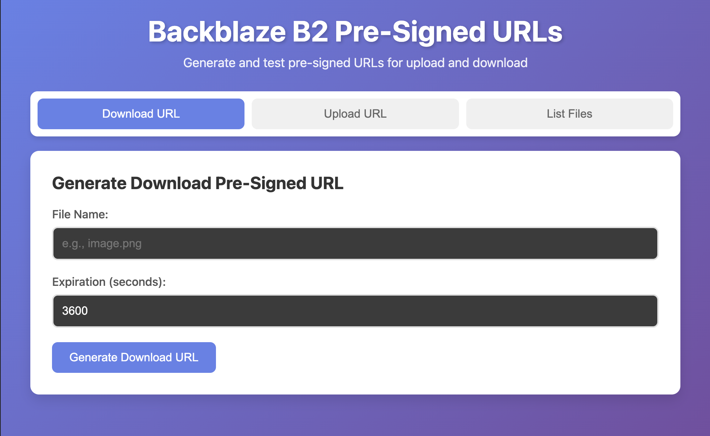
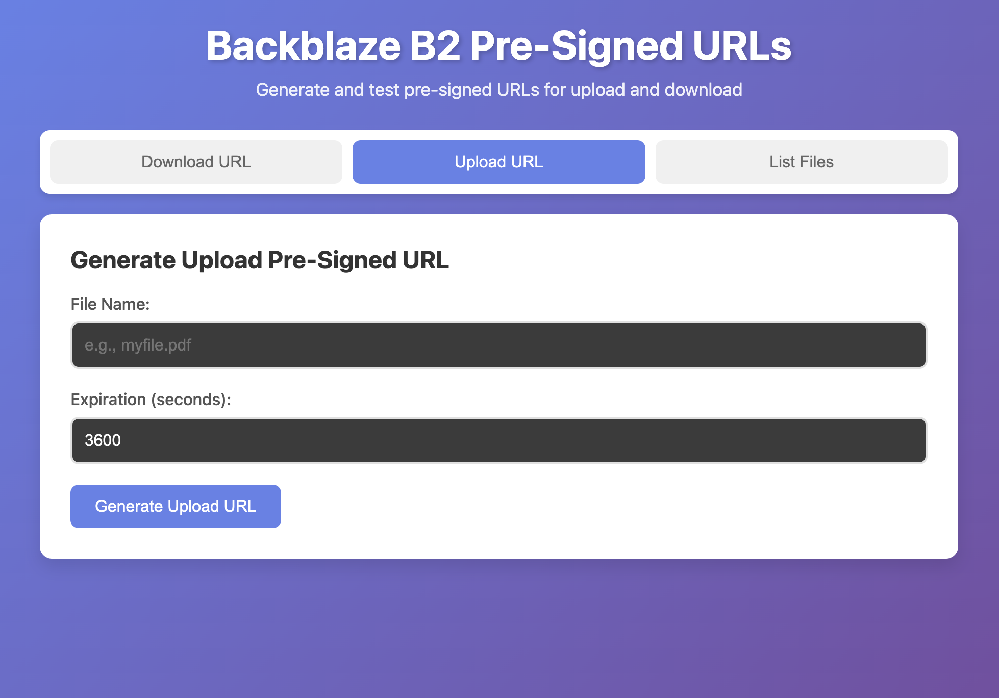
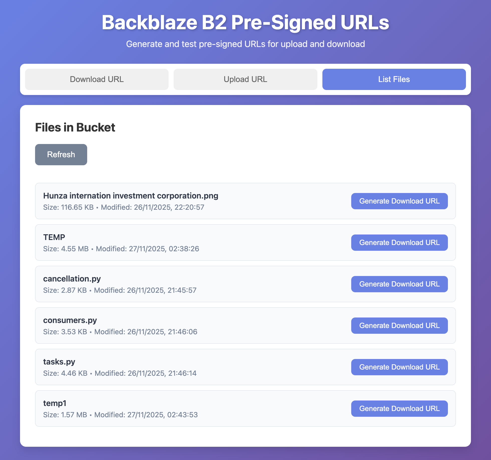

# Backblaze B2 Pre-Signed URLs Application

A full-stack web application for generating and testing pre-signed URLs with Backblaze B2 storage.

## Features

- Generate pre-signed URLs for downloading files
- Generate pre-signed URLs for uploading files
- List all files in your B2 bucket
- Test upload functionality directly from the UI
- Customizable expiration times for URLs

## Setup

### 1. Install Dependencies

Make sure you have Python 3.8+ installed. Then install the required packages:

```bash
pip install -r requirements.txt
```

Or if you're using a virtual environment (recommended):

```bash
source venv/bin/activate  # On Windows: venv\Scripts\activate
pip install -r requirements.txt
```

### 2. Get Your Backblaze B2 Application Key

Before configuring the application, you need to create an Application Key in your Backblaze B2 dashboard:

1. Log into https://secure.backblaze.com/
2. Navigate to "B2 Cloud Storage" → "App Keys"
3. Click "Add a New Application Key"
4. Give it a name (e.g., "S3 API Key" or "Pre-signed URLs Key")
5. **Select Capabilities:**
   - Check "readFiles" (required for downloads)
   - Check "writeFiles" (required for uploads)
   - Check "listFiles" (required for listing files)
6. **Select Bucket Access:**
   - Choose your specific bucket from the dropdown
   - OR select "All Buckets" if you want access to all buckets
7. Click "Create New Key"
8. **IMPORTANT:** Copy both the `keyID` and `applicationKey` immediately (they're only shown once)

**Key Format:**
- `keyID`: Should be approximately 25 characters long (e.g., `0050428f1a906270000000001`)
- `applicationKey`: Should be approximately 25-40 characters (e.g., `K005rH1B5kjFA6QgKtyAbzl1F80qMeY`)

### 3. Configure Environment Variables

Create a `.env` file in the root directory with your Backblaze B2 credentials:

```env
B2_APPLICATION_KEY_ID=0050428f1a906270000000001
B2_APPLICATION_KEY=K005rH1B5kjFA6QgKtyAbzl1F80qMeY
B2_ENDPOINT_URL=s3.us-east-005.backblazeb2.com
B2_BUCKET_NAME=your_bucket_name
```

**Important Notes:**
- `B2_APPLICATION_KEY_ID`: The `keyID` from your Backblaze dashboard (25 characters)
- `B2_APPLICATION_KEY`: The `applicationKey` from your Backblaze dashboard (the secret key)
- `B2_ENDPOINT_URL`: Your B2 endpoint URL. You can write it with or without `https://` - it will be added automatically
  - Example: `B2_ENDPOINT_URL=s3.us-east-005.backblazeb2.com` (works)
  - Example: `B2_ENDPOINT_URL=https://s3.us-east-005.backblazeb2.com` (also works)
- `B2_BUCKET_NAME`: Your bucket name (case-sensitive)
- **No quotes, no extra spaces** around the values

**Required Application Key Permissions:**
Your Application Key must have these capabilities:
- `readFiles` - Required for generating download URLs
- `writeFiles` - Required for generating upload URLs
- `listFiles` - Required for listing files in the bucket

The Application Key must also have access to your bucket (either the specific bucket name or "All Buckets").

### 4. Run the Application

Start the Flask server:

```bash
python app.py
```

The application will be available at `http://localhost:5001`

**Note:**
- The default port is 5001 (to avoid conflicts with macOS AirPlay on port 5000)
- If port 5001 is also in use, you can set a custom port in your `.env` file:
  ```env
  PORT=8080
  ```
- The frontend automatically detects the port, so no manual configuration is needed

## Application Interface

The application features a modern, user-friendly web interface with three main tabs for different operations. Here's what the application looks like:

### Download URL Tab

The Download URL tab allows you to generate pre-signed URLs for downloading existing files from your B2 bucket.



**Features:**
- Clean form interface with file name input
- Configurable expiration time (default: 1 hour)
- Displays generated URL with expiration details
- One-click link to test the download

### Upload URL Tab

The Upload URL tab lets you generate pre-signed URLs for uploading new files and includes a built-in file upload tester.



**Features:**
- Generate upload URLs with custom file names
- Built-in file upload tester
- Automatic fallback to server proxy if CORS blocks direct upload
- Real-time upload status and feedback

### List Files Tab

The List Files tab provides a complete file browser for your B2 bucket with quick actions.



**Features:**
- View all files in your bucket with details (name, size, last modified)
- Quick "Generate Download URL" button for each file
- Refresh button to reload the file list
- Empty state message when bucket is empty

## Usage

### Using the Web Interface

Open your browser and navigate to `http://localhost:5001`

#### Tab 1: Download URL

Generate a pre-signed URL to download an existing file from your B2 bucket.

1. Click on the "Download URL" tab (selected by default)
2. Enter the file name of the file you want to download (e.g., `image.png`, `document.pdf`)
   - **Important:** The file must already exist in your B2 bucket
3. (Optional) Set the expiration time in seconds (default is 3600 = 1 hour)
   - Maximum: 604800 seconds (7 days)
4. Click "Generate Download URL"
5. The generated URL will appear below with:
   - The full pre-signed URL
   - Expiration details
   - A clickable link to test the download

#### Tab 2: Upload URL

Generate a pre-signed URL to upload a new file to your B2 bucket.

1. Click on the "Upload URL" tab
2. Enter the file name for the file you want to upload (e.g., `new-document.pdf`)
   - This will be the name of the file in your B2 bucket
3. (Optional) Set the expiration time in seconds (default is 3600 = 1 hour)
4. Click "Generate Upload URL"
5. After generating the URL, a "Test Upload" section will appear
6. Click "Choose File" and select a file from your computer
7. Click "Upload File" to test the upload
8. You'll see a success message if the upload works

#### Tab 3: List Files

View all files currently in your B2 bucket.

1. Click on the "List Files" tab
2. The application will automatically load all files from your bucket
3. For each file, you'll see:
   - File name
   - File size (formatted in KB, MB, GB)
   - Last modified date
   - A "Generate Download URL" button
4. Click "Generate Download URL" on any file to:
   - Automatically switch to the Download URL tab
   - Pre-fill the file name
   - Generate a download URL for that file
5. Click "Refresh" to reload the file list

### Common Workflows

**Download an Existing File:**
1. Go to "List Files" tab
2. Find the file you want
3. Click "Generate Download URL"
4. Click the generated link to download

**Upload a New File:**
1. Go to "Upload URL" tab
2. Enter a file name (e.g., `my-document.pdf`)
3. Click "Generate Upload URL"
4. Select your file and click "Upload File"
5. Go to "List Files" tab to verify the upload

**Share a File Temporarily:**
1. Go to "Download URL" tab
2. Enter the file name
3. Set expiration (e.g., 3600 for 1 hour)
4. Copy the generated URL
5. Share the URL with others (it will expire after the set time)

## API Endpoints

### POST `/api/generate-download-url`

Generate a pre-signed URL for downloading a file.

**Request Body:**
```json
{
  "file_name": "example.pdf",
  "expiration": 3600
}
```

**Response:**
```json
{
  "success": true,
  "url": "https://...",
  "file_name": "example.pdf",
  "expiration_seconds": 3600,
  "expires_at": 1234567890.123
}
```

### POST `/api/generate-upload-url`

Generate a pre-signed URL for uploading a file.

**Request Body:**
```json
{
  "file_name": "example.pdf",
  "expiration": 3600
}
```

**Response:**
```json
{
  "success": true,
  "url": "https://...",
  "file_name": "example.pdf",
  "expiration_seconds": 3600,
  "expires_at": 1234567890.123
}
```

### GET `/api/list-files`

List all files in the bucket.

**Response:**
```json
{
  "success": true,
  "files": [
    {
      "name": "example.pdf",
      "size": 1024,
      "last_modified": "2024-01-01T00:00:00"
    }
  ]
}
```

### GET `/api/check-config`

Check configuration status and test bucket access (for debugging).

**Response:**
```json
{
  "B2_APPLICATION_KEY_ID": "Set",
  "B2_APPLICATION_KEY": "Set",
  "B2_ENDPOINT_URL": "https://s3.us-east-005.backblazeb2.com",
  "B2_BUCKET_NAME": "AM-PRESIGNED-URLS",
  "bucket_access": "Authorized",
  "connection_test": "Success"
}
```

## Troubleshooting

### Connection Error

**Problem:** Can't connect to Backblaze B2

**Solutions:**
- Make sure your B2 endpoint URL is correct and includes the region
- Verify the endpoint format: `https://s3.<region>.backblazeb2.com`
- Check that your `.env` file has no quotes or extra spaces

### Access Denied / InvalidAccessKeyId

**Problem:** "Malformed Access Key Id" or "Access Denied" errors

**Solutions:**
- Verify your B2 credentials are correct in the `.env` file
- Make sure `B2_APPLICATION_KEY_ID` is approximately 25 characters long
- Ensure there are no quotes or extra spaces around values in `.env`
- Check that you're using the correct `keyID` (not the `applicationKey`) for `B2_APPLICATION_KEY_ID`
- Restart your server after updating `.env` file

### UnauthorizedAccess Error

**Problem:** Getting "bucket is not authorized" error when using pre-signed URLs

**Solutions:**
1. **Verify Application Key Permissions:**
   - Go to Backblaze B2 Dashboard → "App Keys"
   - Find your Application Key and check the "capabilities" column
   - It must include: `readFiles`, `writeFiles`, `listFiles`
   - It must also have `shareFiles` capability for pre-signed URLs

2. **Check Bucket Access:**
   - Look at the "bucketName" column for your key
   - It should show your specific bucket name OR "All Buckets"
   - If it shows a different bucket, create a new key with access to your bucket

3. **Create a New Key (if needed):**
   - Click "Add a New Application Key"
   - Name it (e.g., "S3 API Key")
   - Select capabilities: `readFiles`, `writeFiles`, `listFiles`, `shareFiles`
   - Select your bucket from the dropdown (or "All Buckets")
   - Click "Create New Key"
   - Copy the new `keyID` and `applicationKey`
   - Update your `.env` file with the new keys
   - Restart your server

4. **Verify Configuration:**
   - Visit `http://localhost:5001/api/check-config`
   - Look for `"bucket_access": "Authorized"` in the response
   - If it says "Unauthorized", your key doesn't have the right permissions

### File Not Found

**Problem:** "File not found" error when generating download URL

**Solutions:**
- Ensure the file exists in your bucket before generating a download URL
- Check that the file name matches exactly (case-sensitive)
- Use the "List Files" tab to see what files are actually in your bucket

### Key ID Too Short

**Problem:** Warning about keyID being too short (12 characters instead of 25)

**Solutions:**
- You're likely using a "Master Application Key" which doesn't work with S3-compatible API
- Create a regular "Application Key" (not Master) that starts with the correct format
- The keyID should be approximately 25 characters long
- Update your `.env` file with the new keyID

### CORS Errors

**Problem:** CORS errors in browser console

**Solutions:**
- The Flask app includes CORS support
- Make sure you're accessing it from `localhost:5001` (or your configured port)
- Check that the server is running

### CSS/JS Not Loading

**Problem:** Page loads but styling and JavaScript don't work

**Solutions:**
- Make sure the server is running
- Check the browser console for errors
- Try refreshing the page (Ctrl+R or Cmd+R)
- Verify that `static/styles.css` and `static/script.js` files exist

### Upload Not Working

**Problem:** File upload fails

**Solutions:**
- Make sure you generated an upload URL first
- Check the file size (very large files may timeout)
- Verify the file name doesn't contain special characters
- Check browser console for specific error messages

## Project Structure

```
.
├── app.py                 # Flask backend application
├── requirements.txt       # Python dependencies
├── .env                  # Environment variables (not in git)
├── images/               # Application screenshots
│   ├── download.png      # Download URL interface screenshot
│   ├── upload.png        # Upload URL interface screenshot
│   └── list-files.png    # List Files interface screenshot
├── static/
│   ├── index.html        # Frontend HTML
│   ├── styles.css        # Frontend styles
│   └── script.js         # Frontend JavaScript
└── README.md             # This file
```

## Security Notes

- Never commit your `.env` file to version control
- Pre-signed URLs expire after the specified time
- Keep your B2 credentials secure
- Consider using environment-specific configurations for production
- Application Keys should have the minimum required permissions
- Use shorter expiration times for sensitive files

## License

MIT
